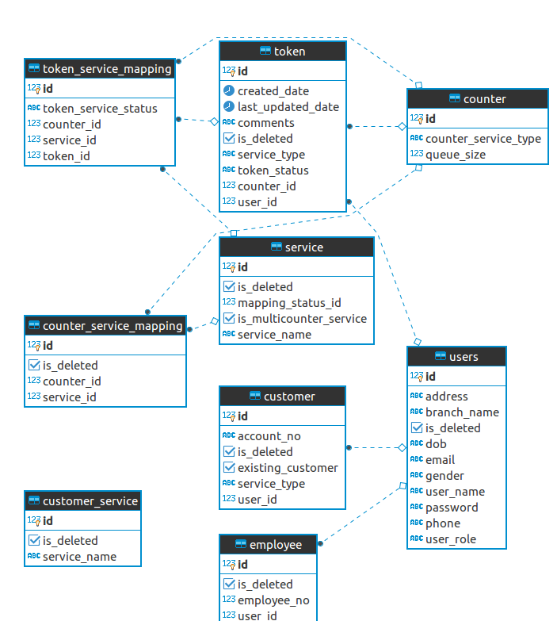

# BankingTokenSystem

Problem: A bank, ABC Bank, has many branches and customers. Each branch has a limited number of teller counters.

ABC Bank provides a better customer experience to their premium customers by providing priority over non premium customers (less waiting time at branches).

In order to achieve this, ABC Bank has decided to introduce new machines to manage queues at each of their branches.

Tech Stack:

1.Java - 1.8

2.Spring Boot - 2.0.0

3.PostgreSql - 9.5.10

Setup Instructions
Prerequisite:

1.Java 1.8 or higher installed

2.PostgreSql 9.5 or higher installed (https://www.postgresql.org/download/linux/ubuntu/)

3.active-spring.Maven installed (https://maven.apache.org/install.html)

Run Application:

mvn install && java -jar target/token-generation-management-0.0.1-SNAPSHOT.jar

View Rest Api Documentation:
Swagger is integrated to the application. To view documentation, follow the below url after running the application http://localhost:9090/swagger-ui.html

Design Diagrams
Please refer to ER.png and entity.uml diagrams

## List of Apis:

### `Token Controller`:

@PostMapping  /tokens (desc = Api method to Generate Token for a Service Request)

@PutMapping ("/tokens/{tokenId}") (desc = Api method to update Token for a Service Request)

@PostMapping("/tokens/{tokenId}/status") (desc = Api method to update Token status for a Service Request. Note:- Only available for Internal Users)

### `Counter Controller:`
@GetMapping("/counters/{counterId}/token") (desc =Process token at particulat Counter)

@GetMapping("/counters/all") (desc = Retreive list of all counters and their details)

### `User Controller:`
@PostMapping("/users") (desc = Api method to create User)

@PutMapping("/users/{userId}") (desc = "Api method to update User")

@GetMapping("/users/{userId}") (desc = Api method to retrieve User)

## List of Services methods: 

### `User Service`

UserDto createUser(UserDto userDto); (desc = Service method to implement create new User.)

UserDto updateUser(UserDto userDto); (desc = Service method to implement update User details)

UserDto getUser(int userId); (desc = Service method to retrieve User details.)

### `Token Service`

TokenDto generateToken(TokenDto tokenDto); (desc = Generate Token for the Service Request)

Token getNextTokenForProcessing(Integer counterId); (desc = Retrieve Token details based on TokenId.)

TokenDto updateToken(TokenDto tokenDto); (desc = Update Token Details.)

void updateTokenStatus(Integer tokenId, TokenStatus tokenStatus); (desc = Update Token Status.)

### `Counter Service`

Integer getCounterForTokenServices(Set<BankService> bankServices) (desc = Assign Counter for a Token)

### ER Diagram:-

